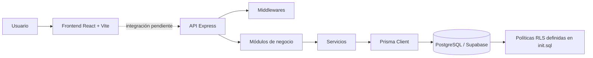

# Arquitectura actual de AI Financial Manager

> **Fecha de referencia:** 6 de octubre de 2026  
> **Estado:** fotografía del código existente en el repositorio, no del diseño futuro.

## 1. Resumen ejecutivo

El sistema está organizado como una aplicación web separada en dos proyectos:

- **Frontend:** aplicación React 19 ejecutada y construida con Vite.
- **Backend:** API HTTP en Node.js con Express 5.
- **Persistencia:** PostgreSQL, con un esquema diseñado para Supabase y acceso desde el backend mediante Prisma 7 y el adaptador `@prisma/adapter-pg`.

La base de datos ya contempla los principales dominios financieros: usuarios, categorías, ingresos, gastos, metas de ahorro, aportes de ahorro e inversiones. En cambio, la capa funcional todavía está en una etapa temprana: el frontend conserva la pantalla inicial de Vite y el backend únicamente tiene un módulo parcial para ingresos.

## 2. Vista general de componentes



### Componentes actuales

| Componente | Tecnología | Ubicación | Responsabilidad actual |
|---|---|---|---|
| Interfaz web | React 19, React DOM | `frontend/ai-finacial-manager/src` | Renderiza la pantalla inicial basada en la plantilla de Vite. |
| Servidor HTTP | Node.js, Express 5 | `backend/src` | Crea la aplicación, habilita CORS/JSON y expone el servidor. |
| Módulo de ingresos | Express Router, controladores y servicios | `backend/modules/ingresos` | Define operaciones CRUD de ingresos, aunque el router aún no está conectado a la aplicación principal. |
| ORM | Prisma 7 | `backend/prisma` | Define el modelo relacional y genera el cliente de acceso a datos. |
| Base de datos | PostgreSQL | Configurada mediante `DATABASE_URL` y `DIRECT_URL` | Almacena la información financiera y las relaciones entre entidades. |
| Seguridad de datos | Row Level Security de Supabase | `backend/init.sql` | Define políticas por usuario en la base de datos. El middleware de autenticación todavía no aparece implementado en el backend. |

## 3. Estructura del repositorio

```text
/
├── ARQUITECTURA_ACTUAL.md
├── backend/
│   ├── init.sql
│   ├── prisma/
│   │   └── schema.prisma
│   ├── prisma.config.ts
│   ├── modules/
│   │   └── ingresos/
│   │       ├── ingreso.controller.js
│   │       ├── ingreso.routes.js
│   │       └── ingreso.service.js
│   └── src/
│       ├── app.js
│       ├── server.js
│       ├── config/
│       │   ├── env.js
│       │   └── prisma.js
│       └── middlewares/
│           └── error.middleware.js
└── frontend/
    └── ai-finacial-manager/
        ├── vite.config.js
        └── src/
            ├── App.jsx
            ├── main.jsx
            ├── App.css
            └── index.css
```

## 4. Backend

### 4.1 Arranque de la aplicación

El punto de entrada es `backend/src/server.js`. El proceso:

1. Carga la aplicación Express.
2. Carga y valida las variables de entorno.
3. Inicializa el cliente Prisma.
4. Escucha en el puerto configurado, por defecto `4000`.
5. Desconecta Prisma cuando recibe `SIGINT` o `SIGTERM`.

`backend/src/app.js` configura:

- `cors()` sin opciones personalizadas.
- `express.json()` para recibir cuerpos JSON.
- `GET /`, que devuelve un mensaje de disponibilidad de la API.
- El middleware global de errores.

### 4.2 Capas del módulo de ingresos

El módulo sigue una separación básica por capas:

```text
HTTP request
    ↓
ingreso.routes.js
    ↓
ingreso.controller.js
    ↓
ingreso.service.js
    ↓
Prisma Client
    ↓
PostgreSQL
```

Las rutas declaradas son:

| Método | Ruta relativa | Operación |
|---|---|---|
| `POST` | `/` | Crear un ingreso |
| `GET` | `/` | Listar ingresos |
| `PUT` | `/:id` | Actualizar un ingreso |
| `DELETE` | `/:id` | Eliminar un ingreso |

El servicio usa `usuarioId` para restringir las operaciones de actualización y eliminación al propietario del registro. El controlador obtiene ese valor desde `req.usuarioId`, lo que presupone un middleware de autenticación que actualmente no está presente en los archivos de la aplicación.

### 4.3 Estado de integración del módulo

Los routers de los módulos financieros están registrados en `backend/src/app.js` bajo `/api`:

- `/api/categorias`
- `/api/ingresos`
- `/api/gastos`
- `/api/metas-ahorro`
- `/api/aportes-ahorro`
- `/api/inversiones`
- `/api/movimientos`

Todos ofrecen `POST`, `GET`, `GET /:id`, `PUT /:id` y `DELETE /:id`. Las operaciones se restringen al usuario identificado por `req.usuarioId` o por el encabezado `X-User-Id`. Mientras se integra la verificación JWT de Supabase, el middleware rechaza las solicitudes sin un UUID de usuario con `401`.

`/api/movimientos` funciona como una fachada unificada sobre ingresos y gastos. Devuelve ambos tipos con el campo `tipo` y admite los filtros `tipo`, `desde` y `hasta`. La escritura continúa delegándose a los módulos de cada entidad, que persisten mediante Prisma en la base de datos de Supabase.

## 5. Frontend

El frontend se inicia desde `frontend/ai-finacial-manager/src/main.jsx`, que monta `App` dentro de `StrictMode`.

Actualmente `App.jsx` es la pantalla de inicio generada por Vite:

- Muestra imágenes de React, Vite y `hero.png`.
- Tiene un contador local manejado con `useState`.
- Incluye enlaces a documentación y comunidades de Vite.
- No contiene todavía pantallas financieras, autenticación, cliente HTTP ni llamadas a la API.

La configuración de Vite utiliza:

- `@vitejs/plugin-react`.
- Babel con `reactCompilerPreset`.
- `oxlint` para linting.

No se observa una configuración de proxy de Vite ni una variable de entorno del frontend para la URL del backend.

## 6. Modelo de datos

El modelo Prisma representa las siguientes entidades:

```text
Usuario
 ├── Categorias
 ├── Ingresos ── Categoría
 ├── Gastos ──── Categoría
 ├── MetasAhorro
 │    └── AportesAhorro
 └── Inversiones
```

### Entidades principales

- **Usuario:** identificado por el UUID de `auth.users` en el esquema SQL inicial.
- **Categoría:** pertenece a un usuario y puede ser utilizada por ingresos y gastos.
- **Ingreso:** monto, descripción, fecha de ocurrencia, usuario y categoría.
- **Gasto:** estructura equivalente a un ingreso.
- **MetaAhorro:** objetivo financiero con monto, fecha objetivo y estado.
- **AporteAhorro:** movimiento asociado a una meta de ahorro.
- **Inversión:** nombre, tipo, monto invertido, valor actual, estado y fechas.

El esquema usa:

- UUID como identificador.
- `Decimal(14, 2)` para importes monetarios.
- Fechas `timestamptz` para eventos y auditoría.
- Relaciones con borrado en cascada para los datos dependientes del usuario.
- Restricción para impedir que una categoría de otro usuario se asigne a un ingreso o gasto.
- Índices por usuario, fecha y estado para las consultas principales.

`backend/init.sql` agrega restricciones de dominio, triggers para `actualizado_en` y políticas RLS para que cada usuario opere únicamente sobre sus propios datos.

## 7. Configuración y ejecución

### Backend

Variables requeridas:

```env
DATABASE_URL=...
DIRECT_URL=...
PORT=4000
```

- `DATABASE_URL` se utiliza en el adaptador PostgreSQL de Prisma.
- `DIRECT_URL` se utiliza en `prisma.config.ts` para las operaciones de Prisma.
- `PORT` es opcional y por defecto vale `4000`.

Comandos disponibles desde `backend/`:

```bash
npm run dev
npm start
npm run prisma:generate
npm run prisma:validate
```

### Frontend

Comandos disponibles desde `frontend/ai-finacial-manager/`:

```bash
npm run dev
npm run build
npm run lint
npm run preview
```

## 8. Estado actual y pendientes técnicos

### Implementado

- Separación de frontend y backend.
- Servidor Express funcional con endpoint raíz.
- Configuración de CORS y parsing JSON.
- Cliente Prisma conectado mediante PostgreSQL.
- Modelo relacional financiero amplio.
- Esquema SQL con RLS, claves foráneas, índices y restricciones.
- Estructura inicial de controladores, rutas y servicios para ingresos.

### Pendiente para tener un flujo funcional de extremo a extremo

1. Registrar `ingreso.routes.js` dentro de `app.js`.
2. Implementar `listarIngresos` en el servicio.
3. Implementar autenticación y el middleware que establezca `req.usuarioId`.
4. Validar cuerpos de entrada, UUID, montos, fechas y categorías antes de llamar a Prisma.
5. Conectar el frontend con el backend mediante un cliente HTTP y una URL configurable.
6. Sustituir la pantalla de demostración de Vite por los módulos financieros.
7. Agregar pruebas automatizadas para rutas, servicios y reglas de aislamiento por usuario.
8. Definir una estrategia única de migraciones: Prisma, SQL de Supabase o una coordinación explícita entre ambos.

## 9. Conclusión

La arquitectura actual es un **monorepo sencillo de dos aplicaciones**, con una base sólida en el diseño de persistencia y una API backend apenas iniciada. El modelo de datos ya anticipa la mayoría de las capacidades de un gestor financiero, pero el flujo completo todavía no está conectado: la interfaz sigue siendo una plantilla, la autenticación no está integrada al backend y el módulo de ingresos aún requiere cableado y completar su servicio.
